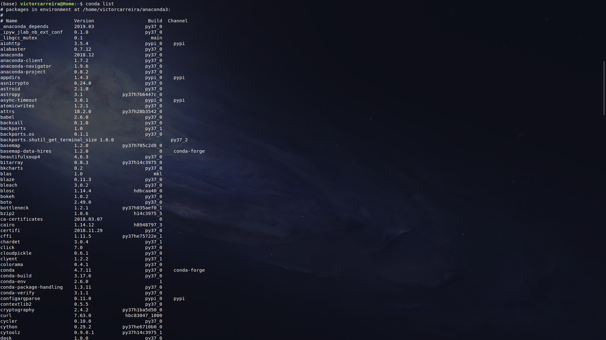

# A Machine Learning Course - MLC
Um curso sobre inteligência artificial.    

## Público Alvo:
 Esse curso destina-se a apresentar os conceitos de inteligência artificial e aprendizado de máquina para geofísicos, geólogos, matemáticos, físicos, estudantes e interessados na área, além de todas as pessoas que gostem de programação e não tem muito dinheiro.

**Responsável**: [Carreira,V.R.](http://lattes.cnpq.br/9663791782095105)

**Aviso Legal:** O material disponibilizado neste repositório está em constante desenvolvimento e o Observatório Nacional não tem nenhuma responsabilidade sobre o seu conteúdo.

## Informações importantes:

Esta página está hospedada em um repositório no GitHub. Um repositório é uma forma muito útil, 
onde muita gente ao redor do mundo vem utilizado por meio do Git e do GitHub, para
fazer colaborações científicas, divulgação, organizar e distribuir
material desenvolvido em disciplinas, palestras, seminários, etc.
AO LONGO DESTE CURSO, NÃO SERÁ COBRADO O CONHECIMENTO SOBRE Git OU
GitHub. Mas, como conhecimento nunca é demais, abaixo segue uma
lista de links úteis sobre Git e GitHub:

* [Tudo que você queria saber sobre Git e GitHub, mas tinha vergonha de perguntar](http://tableless.com.br/tudo-que-voce-queria-saber-sobre-git-e-github-mas-tinha-vergonha-de-perguntar/)

* [Software Carpentry - Version Control with Git](http://swcarpentry.github.io/git-novice/)

* [Good Resources for Learning Git and GitHub](https://help.github.com/articles/good-resources-for-learning-git-and-github/)

**Agradecimento Especial:** [Dr. Vanderlei C. Oliveira Jr.](http://www.pinga-lab.org/people/oliveira-jr.html)

## Material necessário para o curso:

**fonte:** [GIPHY](https://media.giphy.com/media/tvGOBZKNEX0ac/giphy.gif)

No desenvolvimento deste curso eu pensei em torná-lo o mais abrangente e com o menor custo possível, pois esta é a realidade da maioria das universidades e escolas brasileiras. Mas caso você estude em uma universidade ou trabalhe em uma empresa com muitos recursos saiba que esse curso também serve para você! 

Em termos de Hardware você vai precisar nada mais do que um Intel Core I3 ou um AMD Athlon 200GE com 4gb Ddr3 ou superior. 

Em termos de software vamos precisar do python**3.X** instalado em seus sistema, seja ele windows, linux ou macOS. E para tornar o curso mais amigável iremos utilizar a plataforma [Jupyter Notebook](https://jupyter.org/).

## O Jupyter Notebook:

O [Jupyter Notebook](https://jupyter.org/) é um
arquivo com extensão `.ipynb` e permite combinar código, texto, equações feitas
em TeX, figuras e animações. Além disso, é gratuito e extremamente bem
documentado. Esta poderosa ferramenta computacional possibilita reunir (quase)
todas as etapas envolvidas no desenvolvimento de um código com fins acadêmicos,
desde a leitura e processamento dos dados até a visualização dos resultados.

## Instalação do Python e de suas dependências

Para instalar o Python Anaconda, sugiro
seguir as [instruções do Software Carpentry](https://carpentries.github.io/workshop-template/#python).
Outra opção é acessar diretamente o [site o Python Anaconda](https://www.anaconda.com/distribution/#download-section).

**IMPORTANTE**: Usaremos o Python 3.x!

Para checar se a instalação deu certo, abra uma janela do prompt de comando,
caso você esteja no Windows, ou um terminal, se estiver no Linux. Em seguida,
Digite o comando: `conda list`. Este comando mostrará uma lista de *coisas* que
foram instaladas pelo Anaconda. Deve aparecer algo do tipo:

 

 A lista de pacotes continua em ordem alfabética. Note que as informações
 associadas ao pacote `anaconda` são `2019.03` e `py37_0`.

## Sites importantes!

 * [Fatiando a Terra](http://www.fatiando.org/index.html)

 * [Computational Infrastructure for Geodynamics (CIG)](http://geodynamics.org/cig/)

 * [Generic Mapping Tools (GMT)](http://gmt.soest.hawaii.edu/projects/gmt/wiki)

 * [CFD Python: 12 steps to Navier-Stokes :: Lorena A. Barba group](http://lorenabarba.com/blog/cfd-python-12-steps-to-navier-stokes/)

 * [Software Carpentry](http://software-carpentry.org/index.html)

 * [Pythonic Perambulations](https://jakevdp.github.io/)

 * [A gallery of interesting Jupyter Notebooks](https://github.com/jupyter/jupyter/wiki/A-gallery-of-interesting-Jupyter-Notebooks)

 * [Notebook Gallery - Links to the best IPython and Jupyter Notebooks](http://nb.bianp.net/sort/views/)

 * [matplotlib - 2D and 3D plotting in Python](http://nbviewer.jupyter.org/github/jrjohansson/scientific-python-lectures/blob/master/Lecture-4-Matplotlib.ipynb)

 * [WolframMathWorld](http://mathworld.wolfram.com/)

 * [Various writings - Hans Petter Langtangen](http://hplgit.github.io/)

 * [scikit-learn: Machine Learning in Python](http://scikit-learn.org/stable/index.html)

 * [Codecademy](https://www.codecademy.com/about)

 * [Pandas](http://pandas.pydata.org/)

 * [SciPy](https://scipy.org/about.html)
